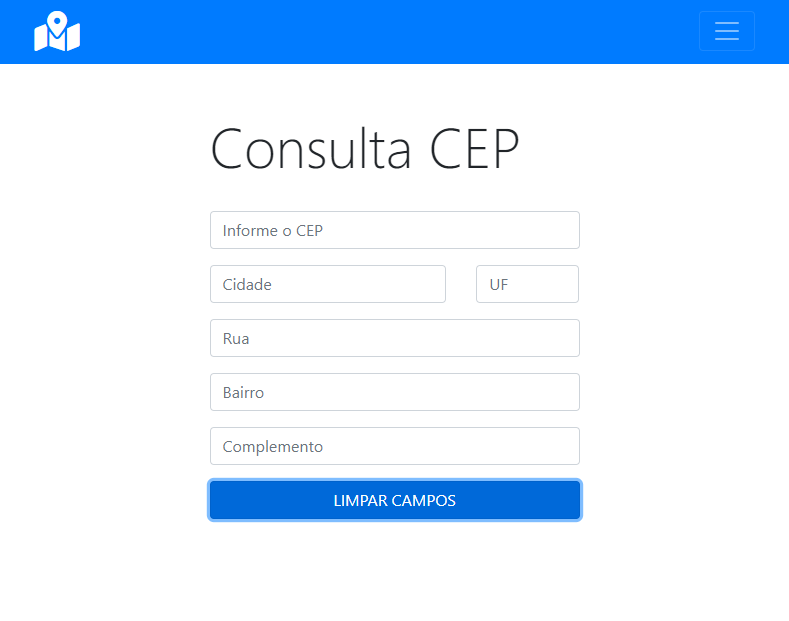
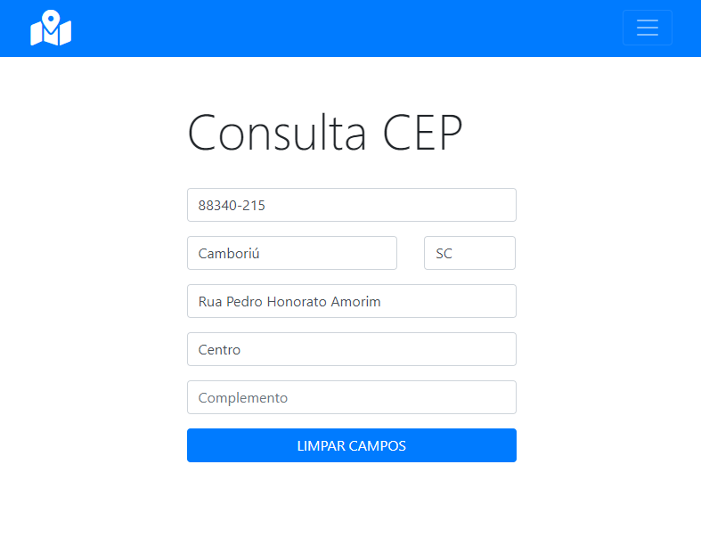

# Aplicação p/ consulta de CEP
> Uma aplicação que retorna os dados referentes a um CEP informado requisitando dados de uma API via jQuery.

Este projeto é uma aplicação capaz de fazer uma requisição via JS usando o Ajax na API pública do site [Via CEP], deste modo, se os dados forem retornados corretamente, a aplicação preenche os campos com suas respectivas informações recuperadas na API.

## Exibição 1 - Consulta CEP



## Exibição 2 - Consulta CEP



## Instalação

Para executar o projeto localmente o repositório deve ser clonado da forma desejada:
```
$ git clone https://github.com/jonathannunesdsouza/consulta.cep.github.io.git
```

## Histórico de atualização 

* 0.0.1;
    * Lançamento inicial.

## Meta 

Jonathan Douglas Nunes de Souza - [@jonathansouza] - <jonathannunes.souza98@gmail.com>

[@jonathansouza]:https://www.linkedin.com/in/perfil-in/

Distribuido sob licença. Veja **`LICENÇA`** para mais informações.

[https://github.com/jonathannunesdsouza/jonathannunesdsouza.github.io]

[Via CEP]:https://viacep.com.br/ws/16406060/json/